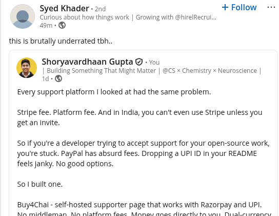
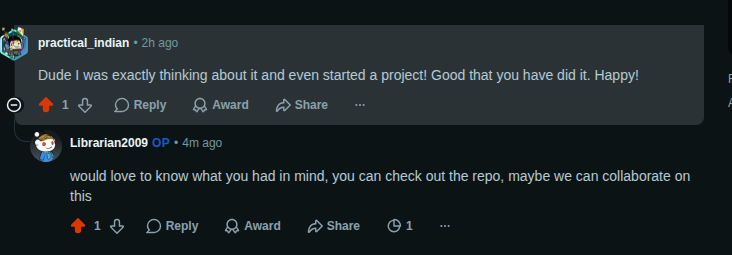
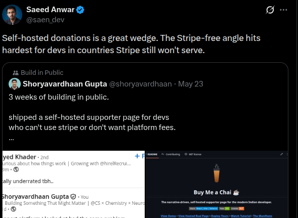

<div align="center">
  
  <h1>Buy4Chai</h1>
  <p><b>The headless tip jar. Bring your own payment gateway.</b></p>
  <p>A static, self-hosted supporter page where <i>you</i> own the gateway, the domain, the deployment, and every rupee. Built for the 2B+ developers Stripe forgot.</p>

  <p>
    
    
    
  </p>

  <p>
    <a href="#quick-start"><strong>Quick Start</strong></a> •
    <a href="#bring-your-own-gateway"><strong>BYO Gateway</strong></a> •
    <a href="https://buy4-chai.vercel.app/"><strong>View Template</strong></a> •
    <a href="https://buy4chai-vassu-v.vercel.app/"><strong>Live Demo</strong></a> •
    <a href="https://land-chai.vercel.app/"><strong>Landing Page</strong></a> •
    <a href="https://land-chai.vercel.app/playground"><strong>Live Preview</strong></a> •
    <a href="#why-this-exists"><strong>Why</strong></a>
  </p>

  <a href="https://buy4chai-vassu-v.vercel.app/">
    
  </a>
</div>

---

## Why This Exists

If you're a developer outside the US/UK/EU, you've probably run into this:

| Platform | The problem |
|---|---|
| Buy Me a Coffee | Stripe only |
| Ko-fi | Stripe only |
| GitHub Sponsors | Stripe only |
| PayPal | 4-5% fees + FIRC compliance paperwork on every payout |
| UPI/PIX/M-Pesa link in your README | Works, but looks improvised and breaks on desktop |

The problem isn't accepting tips. It's that every tipping platform is built around one payment rail, and that rail usually isn't available where you live.

Buy4Chai is just a static site. The payment gateway is whatever works in your country. Plug in your gateway, deploy once, and it runs.

---

## Bring Your Own Gateway

Most tip platforms are built around Stripe. Buy4Chai doesn't have an opinion about your gateway.

The project defines a **Gateway Contract** in [`docs/gateway.md`](./docs/gateway.md) with two integration tiers:

- **Tier 1 (Redirect)** - for any gateway that provides a hosted checkout URL
- **Tier 2 (SDK)** - for any gateway with a JavaScript SDK
- 100% static, no backend, public keys only

To add a gateway, paste this prompt into Claude, Cursor, Copilot, or whichever AI tool you use, along with your gateway's documentation:

```
"Read `docs/gateway.md` and the attached documentation for [Gateway Name]. Follow the architectural best practices and the 'Gateway Contract' defined in `docs/gateway.md`. Decide whether to follow the Tier 1 (Redirect) or Tier 2 (SDK) flow based on the provided docs. Implement `src/gateways/[name].js` ensuring 100% static compliance and zero-backend logic."
```

> [!TIP]
> Clone the repo, open your AI agent, attach your gateway's docs, and let it run. Provide your Public Key ID when asked.

That's how Razorpay got built. That's how Dodo Payments got built.

| Gateway | Status |
|---|---|
| Razorpay | ✅ Shipped |
| Dodo Payments | 🟡 Partial build |
| Stripe / Paddle / Lemon Squeezy | 🟡 ~5 min build |

If your country has a gateway with API docs, it'll work here.

---

## Loved by the Community

<div align="center">
  
  
  <br>
  
</div>

---

## Quick Start

```bash
# 1. Fork and clone
git clone https://github.com/YOUR_USERNAME/Buy4Chai.git
cd Buy4Chai && npm install && npm run dev

# 2. Open the setup wizard
# http://localhost:3000/#setup?key=chai123

# 3. Fill out 6 steps. Copy the generated config to chai.config.js. Push.

# 4. Deploy to Vercel or Netlify. Done.
```

Should take about 10 minutes if you already have a gateway account.

> [!NOTE]
> Check the [AI setup section](#ai-powered-setup) below if you'd rather have an AI agent handle your config. The [tutorial video](#tutorial) walks through the full flow if you want to see it first.
>
> *We built the initial version with Jules async - worth checking out.*

---

## You Own It - Here's What That Gets You

No SaaS, no account system, nothing between you and your supporters. Fork it, deploy it, and it runs independently. If this repo disappears tomorrow, your deployment keeps working. That's not accidental - it's the point.

Here's what you're actually working with:

**The page**

| Section | What it does |
| :--- | :--- |
| Storytelling layout | A proper page for your work, not just a payment button. Space to say what you're building and why. |
| Project showcase | Pin your best open-source work with preview cards. |
| Dual currency | Set amounts in USD, get paid in your local currency. Supporters can toggle between currencies with live conversion. |

**Everything else**

- **0% fees** - money goes directly from supporter to your gateway account. No platform taking a cut.
- **Self-hosted** - deploy on Vercel, GitHub Pages, or Netlify for free. No extra accounts, no lock-in.
- **Setup wizard** - a 6-step guided wizard at `/#setup` that handles your profile, pinned projects, and gateway keys.

**Security**

- **Public keys only** - the config only needs your public key ID. Safe to commit, safe to leave public.
- **Wizard lockdown** - flip one toggle to disable the setup wizard once you're done.
- **Route protection** - the `/#setup` route requires a key only you know.

---

## Tutorial

Walkthrough of the setup wizard and payment flow:

**[Watch the video](https://buy4-chai.vercel.app/complete.mp4)**

---

## AI-Powered Setup

Don't want to fill the config manually? Any AI agent works - Claude, Copilot, Cursor, Jules, whatever you use.

**Step 1:** Fork the repo and open it in your AI agent.

**Step 2:** Copy your profile content from wherever you're active online - GitHub bio, LinkedIn, Twitter, personal site, anywhere. Paste the raw text directly into chat. The agent doesn't need to browse URLs.

**Step 3:** Use this prompt, followed by your pasted content:

```
I want to set up my Buy4Chai supporter page.
I've pasted my profile content below from my online profiles.

Please do the following:

1. Read through everything I've pasted and extract the following:
   - My name
   - A short bio (one or two lines, friendly and human)
   - My avatar/profile image if mentioned or linked
   - My social links (GitHub, LinkedIn, Twitter, website)
   - My best projects worth pinning — name, description, link, and preview image if available

2. Before writing anything, show me what you found and confirm with me:
   - Which projects should be pinned and in what order?
   - Is the bio accurate or should it be reworded?
   - Ask me if I have a profile photo or avatar I want to use
   - Ask me if I have any gallery images I want to show
   - Ask me what thank you message I want supporters to see after they pay

3. Once I've confirmed everything, write it all to `chai.config.js` only. Do not touch any other file. The structure of `chai.config.js` is already in the repo — follow it exactly, just fill in my real values.

4. Rename the personal badge in `public/badges/personal.svg` — replace the placeholder name with my actual name.

5. Once done, verify the full flow:
   - Does the page load correctly?
   - Does the payment modal open?
   - Does the thank you screen appear on success?

6. Give me a clean summary of everything that was added and what my next step is to deploy.

Important rules you must follow:
- Only edit `chai.config.js` and the personal badge — nothing else
- Never ask for or use a secret or private key
- If any information is missing from what I pasted, ask me directly rather than guessing or making something up
- Always confirm with me before writing anything to any file
- Do not assume I use any specific platform — work with whatever content I provide

---

[PASTE YOUR PROFILE CONTENT HERE — from any platform, any format, just copy and paste the text]
```

**Step 4:** Confirm the config the agent puts together, then deploy.

> [!TIP]
> Want to change the accent color? Tell the agent: "Change the accent color to [color] by updating the CSS variables in index.css" and it'll handle it.

---

## Add to Your README

Five badge styles available:

| Style | Preview |
| :--- | :--- |
| **Mono-Chai** |  |
| **Bento-Box** |  |
| **Light Pill** |  |
| **Classic** |  |
| **Shields.io** |  |

**Mono-Chai**
```markdown
[](https://your-deployment-url.vercel.app)
```

**Bento-Box**
```markdown
[](https://your-deployment-url.vercel.app)
```

**Light Pill**
```markdown
[](https://your-deployment-url.vercel.app)
```

**Classic**
```markdown
[](https://your-deployment-url.vercel.app)
```

**Shields.io**
```markdown
[](https://your-deployment-url.vercel.app)
```

Replace `your-deployment-url.vercel.app` with your actual URL.

> [!TIP]
> For the Bento-Box style, use your own deployment as the image source (e.g. `https://your-name.vercel.app/badges/personal.svg`) so the badge shows your name, not the placeholder.

---

## Not Just India

This started as a fix for Indian developers who couldn't use Stripe. But the same problem shows up everywhere. If you build a gateway adapter for your region, open a PR and we'll add it here.

<table>
<tr>
<td valign="top" width="55%">

| Region | Common gateways |
|---|---|
| Latin America | PIX, Mercado Pago, dLocal |
| Africa | M-Pesa, Flutterwave, Paystack |
| Southeast Asia | Midtrans, GoPay, GCash |
| MENA | PayTabs, Tap, HyperPay |

</td>
<td valign="top" width="45%">

**Adapters in the Wild**

| Project | Gateway |
|---|---|
| @vassu-v | Razorpay |
| *(yours here - open a PR)* | |

</td>
</tr>
</table>

---

## Architecture

<table>
<tr>
<td valign="top" width="55%">

React 18, Vite, Tailwind CSS, Framer Motion. Fully static - no server.

- **[Master Manifesto](docs/master.md)** - the why behind the project and the roadmap
- **[Design System](docs/design.md)** - tokens and component structure
- **[Gateway Contract](docs/gateway.md)** - how to add a new gateway in about 10 minutes

</td>
<td valign="top" width="45%">

| Layer | Tech |
|---|---|
| UI | React 18 |
| Build | Vite |
| Styling | Tailwind CSS |
| Animation | Framer Motion |
| Deployment | Vercel / Netlify / GitHub Pages |

</td>
</tr>
</table>

---

<div align="center">
  <p>Built for the open source community.</p>
  <a href="https://buy4chai-vassu-v.vercel.app/">
    
  </a>
  <p><i>If this helped you, a star goes a long way.</i></p>
</div>
